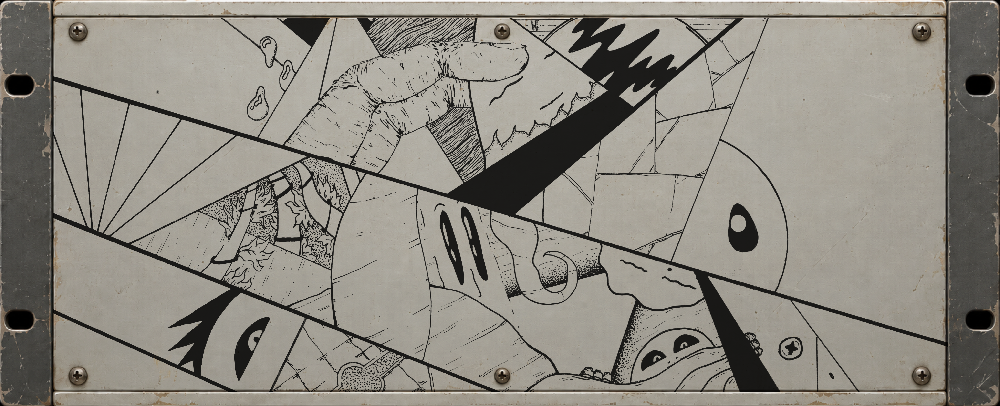

# UTALI-EQ

Vintage analog character equalizer plugin built with JUCE. It combines classic British console style parametric bell filters for the midrange with program equalizer boost and cut interactions on the low and high shelves, plus an analog saturation stage.

<p align="center">
  
</p>

## Overview

UTALI-EQ merges two classic EQ workflows into a single interface:

1. Low and High Shelves: Independent boost and cut controls running simultaneously at selected frequency points (Pultec style trick), allowing you to sculpt low-end punch and top-end air without muddiness or harshness.
2. Low-Mid and High-Mid Bells: Fully parametric midrange filters with gain, frequency, and Q bandwidth controls.
3. Master and Character Section: Switchable harmonic saturation (Clean, Transistor, Tube, Tape) with drive control, a 12 dB/oct high-pass filter, and output level trimming.

Available as a VST3 plugin for macOS and Windows.

## Controls

### Low Band
- Low Boost: 0 dB to +12 dB
- Low Atten: 0 dB to -18 dB
- Low Freq: 30, 60, 100, or 200 Hz

### Low-Mid (LMF)
- Gain: -12 dB to +12 dB
- Freq: 200 Hz to 2000 Hz
- Q: 0.5 to 3.0

### High-Mid (HMF)
- Gain: -12 dB to +12 dB
- Freq: 1500 Hz to 8000 Hz
- Q: 0.5 to 3.0

### High Band
- High Boost: 0 dB to +12 dB
- High Atten: 0 dB to -18 dB
- High Freq: 6 kHz, 8 kHz, 10 kHz, or 12 kHz

### Master / Vibe
- Vibe: Clean, Transistor, Tube, or Tape saturation circuits
- HPF: 20 Hz to 400 Hz high-pass filter
- Drive: 0 dB to +24 dB input drive into the vibe circuit
- Output: -24 dB to +24 dB master output gain

## Installation

Download the latest release for your platform from the [Releases](https://github.com/DJMAccie/Utali-EQ/releases) page.

### macOS
Download `UTALITEQ-macOS.zip` and extract `UTALITEQ.vst3`:
- Copy `UTALITEQ.vst3` to `/Library/Audio/Plug-Ins/VST3/` (or `~/Library/Audio/Plug-Ins/VST3/`).
- If your DAW does not show the plugin immediately, rescan plugins in your DAW settings or run `killall -9 AudioComponentRegistrar` in Terminal.

### Windows
Download `UTALITEQ-Windows.zip` and extract `UTALITEQ.vst3`:
- Copy the `UTALITEQ.vst3` folder to `C:\Program Files\Common Files\VST3\`.
- Rescan plugins in your DAW.

## Building from Source

### Requirements
- CMake 3.22 or newer
- C++20 compiler (Clang/Xcode on macOS, MSVC on Windows)
- Ninja or Make (optional, recommended for macOS)

### macOS / Linux
```bash
git clone https://github.com/DJMAccie/Utali-EQ.git
cd Utali-EQ

cmake -B build -G Ninja -DCMAKE_BUILD_TYPE=Release
cmake --build build --config Release
```

### Windows
```powershell
git clone https://github.com/DJMAccie/Utali-EQ.git
cd Utali-EQ

cmake -B build -A x64 -DCMAKE_BUILD_TYPE=Release
cmake --build build --config Release
```

The compiled VST3 bundle will be in `build/UTALITEQ_artefacts/Release/VST3/`.

## License

Created by Utali Audio. Built with JUCE.
